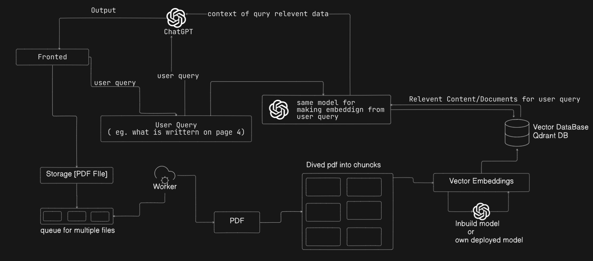

# PDF Assistant - Intelligent Document Chat System

---

## Overview
**PDF Assistant** is a sophisticated **RAG (Retrieval-Augmented Generation)** system that enables users to have intelligent conversations with their PDF documents.  
The system leverages cutting-edge AI technologies to provide **accurate, context-aware responses** based solely on the content of uploaded PDF files.

---

## 🏗️ System Architecture

### system desgin


---

## 🛠️ Technology Stack

### Frontend
- **Next.js 14** – React framework with App Router  
- **TypeScript** – Type-safe development  
- **Tailwind CSS** – Utility-first styling with dark mode support  
- **Clerk** – Authentication and user management  
- **React Hooks** – State management and component logic  

### Backend
- **Node.js** – Runtime environment  
- **Express.js** – Web framework  
- **TypeScript** – Ensures type safety and maintainability  

### AI & ML Services
- **Groq API** – High-performance LLM inference (Llama-3.3-70B)  
- **Google Embedding Model** – Text embedding generation  
- **Custom RAG Pipeline** – Retrieval-Augmented Generation  

### Data & Queue Management
- **Qdrant** – Vector database for similarity search  
- **Redis** – In-memory data store  
- **BullMQ** – Queue management for PDF processing  
- **Multer** – File upload handling  

### Infrastructure
- **Docker** – Containerization (optional)  
- **Redis Stack** – Persistent vector storage  

---

## System Components

### 1 File Processing Pipeline
```typescript
// PDF Upload & Processing Flow
User Upload 
  → Multer Validation 
  → BullMQ Queue 
  → Text Extraction 
  → Embedding Generation 
  → Qdrant Storage

File Processing Pipeline
// PDF Upload & Processing Flow
User Upload 
  → Multer Validation 
  → BullMQ Queue 
  → Text Extraction 
  → Embedding Generation 
  → Qdrant Storage

Vector Search Architecture
 → Embedding Model: Google’s Text Embedding API
 → Vector Database: Qdrant with HNSW indexing
 → Search Method: Cosine similarity with configurable thresholds


 # 1. Clone the repository
git clone https://github.com/aaryan359/PDF-chat-RAG.git
cd PDF-chat-RAG

# 2. Install dependencies
npm install

# 3. Configure environment variables
cp .env.example .env
# Add your keys (Groq, Google Embeddings, Redis, Qdrant)

# 4. Start Redis & Qdrant (Docker optional)
docker-compose up -d

# 5. Start the server
npm run dev

```